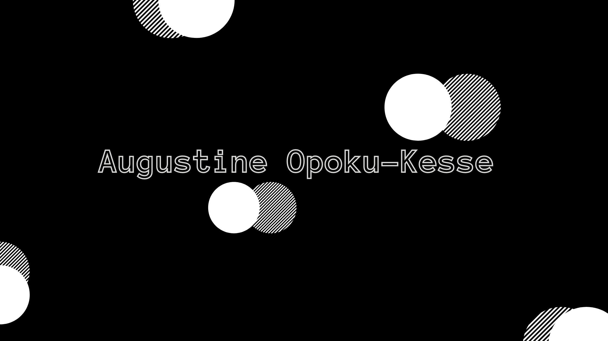

  

<h3 align="center">
Hi there, I'm <a href="https://augustine-ok.github.io/personal-portfolio-site/" target="_blank" rel="noreferrer">Augustine</a> 👋
</h3>

<h2 align="center">
I'm a Junior Front-End Engineer 💻 with 2 years of training and work experience!
</h2> 

I love the entire web/app development process as well as the challenges that come with it. 
The future where I engineer and bring people's thoughts and ideas to life is what excites me the most about my work.

### 🤝 Connect with me: 
<a href="https://www.linkedin.com/in/augustine-opoku-kesse-106011102/">Augustine Opoku-Kesse</a><a href="mailto:aokesse@gmail.com">aokesse@gmail.com</a>
 
- 💬 If you have any question/feedback, please do not hesitate to reach out to me!

 <!-- ## 🌱 I'm currently learning-->

<!-- - Front-End engineering courses in the Front-End Engineer Career Path on <a href="https://www.codecademy.com/" target="_blank">codecademy.com</a>. -->

## 💼 Technical Skills
My core development stack are
- ReactJS
- React Native
- JavaScript
- Typescript
- HTML
- CSS/SCSS
- JQuery

## 🌱 Interests
I am currently learning backend development to become a FullStack Engineer in the foreseeable future. I am also an Applied Researcher, and Data Science enthusiast. 
